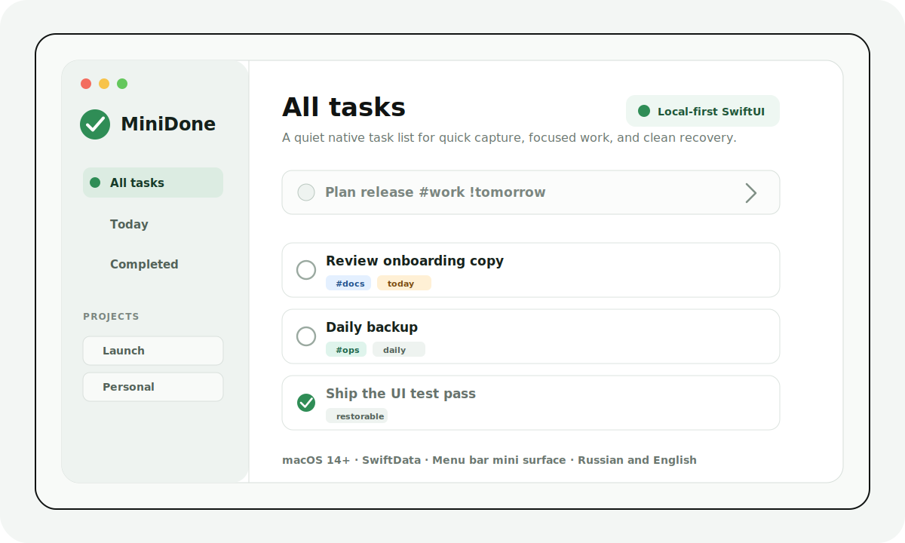
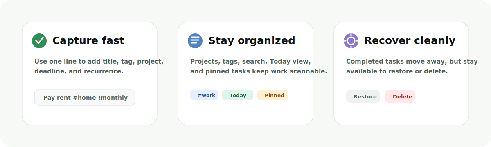

<p align="center">
  
</p>

<h1 align="center">MiniDone</h1>

<p align="center">
  A quiet native macOS task manager for quick capture, focused work, and clean recovery.
</p>

<p align="center">
  
  
  
  
  
</p>

MiniDone is a small Mac utility for people who want tasks nearby, not in the way. It gives you a regular desktop window for planning and a compact menu bar surface for quick work.

The product is intentionally calm: native macOS controls, local data, light and dark themes, Russian and English UI, and smart one-line task entry instead of heavy project-management ceremony.

<p align="center">
  
</p>

## Download

Open the latest GitHub Release and download the attached `MiniDone-macOS-vX.Y.Z.zip` asset. Unzip it and open `MiniDone.app`.

GitHub also shows automatic **Source code** downloads for every tag. Those are for developers and include the repository files and tests. For normal installation, use the `MiniDone-macOS-vX.Y.Z.zip` app asset.

Step-by-step install instructions live in [`docs/github/INSTALL.md`](docs/github/INSTALL.md).

## Platform Support

| Platform | Status |
| --- | --- |
| macOS 14+ Apple Silicon | Supported |
| macOS 14+ Intel | Supported by the universal release build |
| Windows | Not available |
| Linux | Not available |
| iOS / iPadOS | Not available |
| Web | Not available |

## Interface Preview

<p align="center">
  
</p>

<p align="center">
  
</p>

## Features

- **Fast task capture** with a single input line.
- **Smart text commands** for tags, projects, deadlines, and recurring tasks.
- **Projects** for larger areas of work.
- **Tags and tag filters** for lightweight grouping.
- **Today view** for due and overdue tasks.
- **Completed view** with restore and delete actions.
- **Recurring tasks** that create the next occurrence when completed.
- **Pinned tasks**, search, drag reordering, rename, move, undo, and clear completed.
- **Menu bar mini surface** for quick task work without opening the full window.
- **Russian and English localization**.
- **System, light, and dark themes**.
- **Local-first storage** with SwiftData.

## How It Works

MiniDone has two working surfaces:

- The main window is for planning: sidebar navigation, projects, tags, search, Today, Completed, settings, and onboarding.
- The menu bar window is for quick work: add a task, scan urgent items, and complete small tasks without pulling the full app forward.

Tasks are stored locally with SwiftData. Completing a task moves it out of active lists; it can still be restored or deleted from Completed. Recurring tasks keep the completed record and create the next occurrence automatically.

## How To Use

### Add a task

Type a task into the input field and press Return.

```text
Review onboarding copy
```

### Add tags

Use `#tag` anywhere in the task text.

```text
Update screenshots #github
```

### Assign a project

Use `/Project`. For project names with spaces, use quotes.

```text
Plan launch /Work
Write release notes /"MiniDone Release"
```

### Add a deadline

Use `!` commands.

```text
Ship README !today
Plan launch !tomorrow
Call client !mon
Check metrics !+3
Submit build !2026-06-20
```

Russian commands are supported too:

```text
Оплатить подписку !сегодня
Позвонить !завтра
Проверить отчет !пн
Разобрать заметки !через 3 дня
```

### Make a task recurring

Add a repeat command. When you complete the task, MiniDone keeps the completed item and creates the next active occurrence.

```text
Daily backup #ops !daily
Pay rent #home !monthly
Call mom !every monday
```

Russian recurrence commands are supported:

```text
Сделать бэкап #ops !ежедневно
Оплатить аренду !ежемесячно
```

### Complete, restore, or delete

Completed tasks leave the active list, so the current view stays clean. Open **Completed** to restore a task or delete it permanently.

### Work from the menu bar

MiniDone also has a compact menu bar surface for quick capture and completion. Use the main window for planning and the menu bar for small, fast interactions.

## Smart Input Cheatsheet

| Need | Command examples |
| --- | --- |
| Tag | `#work`, `#home`, `#github` |
| Project | `/Work`, `/"Client Project"` |
| Today | `!today`, `!сегодня` |
| Tomorrow | `!tomorrow`, `!завтра` |
| Weekday | `!mon`, `!пн` |
| Relative date | `!+3`, `!через 3 дня` |
| Exact date | `!2026-06-20`, `!20.06` |
| Daily repeat | `!daily`, `!ежедневно` |
| Weekly repeat | `!weekly`, `!еженедельно`, `!every monday` |
| Monthly repeat | `!monthly`, `!ежемесячно` |

## Build Locally

Requirements:

- macOS 14 or newer
- Xcode 15 or newer

Open the project:

```bash
open MiniDone.xcodeproj
```

Choose the `MiniDone` scheme and run the app.

Or build from the command line:

```bash
xcodebuild build \
  -project MiniDone.xcodeproj \
  -scheme MiniDone \
  -destination 'platform=macOS,arch=arm64'
```

## Run Tests

Unit tests:

```bash
xcodebuild test \
  -project MiniDone.xcodeproj \
  -scheme MiniDone \
  -destination 'platform=macOS,arch=arm64' \
  -only-testing:MiniDoneTests
```

UI tests:

```bash
xcodebuild test \
  -project MiniDone.xcodeproj \
  -scheme MiniDone \
  -destination 'platform=macOS,arch=arm64' \
  -only-testing:MiniDoneUITests
```

Latest local verification:

- `46/46` unit tests passed.
- `9/9` UI tests passed.
- Universal Release build succeeds locally for `arm64` and `x86_64`.

## Package A GitHub Release

Create a clean release zip that contains only `MiniDone.app`:

```bash
scripts/package_release.sh
```

The script builds the Release configuration, verifies the app bundle, checks that test/debug artifacts are not inside the app or zip, confirms the release sandbox entitlement, rejects debug entitlements and UI-test launch hooks, removes macOS metadata files, and writes:

```text
dist/MiniDone-macOS-v1.0.zip
```

Tag pushes like `v1.0` also run the GitHub Release workflow in `.github/workflows/release.yml` and upload the same clean app zip as the release asset. Release notes are stored in [`docs/github/release-notes.md`](docs/github/release-notes.md).

## Distribution Notes

The app builds locally, but public macOS distribution still needs a real Apple Developer signing setup:

- Apple Developer Team configured in Xcode.
- Developer ID signing for external distribution.
- Hardened Runtime with a non-ad-hoc signature.
- Notarization before sharing a downloadable build.

## Project Structure

```text
MiniDone/
  Models/          SwiftData models and app enums
  Services/        Localization and window focus helpers
  Utilities/       Styling, constants, and smart text parsing
  ViewModels/      Task, project, and settings logic
  Views/           Main window, menu bar, sidebar, task rows, settings

MiniDoneTests/     Unit tests for parser, models, and view models
MiniDoneUITests/   End-to-end UI flows
docs/github/       README and repository visual assets
```

## GitHub Materials

This repo includes ready-to-use visual assets:

- `docs/github/hero.svg` - README hero preview.
- `docs/github/feature-strip.svg` - feature overview strip.
- `docs/github/social-preview.svg` - editable source for the repository social preview.
- `docs/github/social-preview.png` - upload-ready repository social preview image.
- `docs/github/INSTALL.md` - user-facing installation guide.
- `docs/github/RELEASING.md` - maintainer release checklist.
- `docs/github/release-notes.md` - GitHub Release notes.

To use the social preview on GitHub, upload `docs/github/social-preview.png` in repository settings under **Social preview**.

## Privacy

MiniDone is local-first. Tasks, projects, tags, deadlines, and settings are stored on your Mac through SwiftData. There is no account system, analytics, WebView, or cloud backend in this codebase.

See `docs/security/security-review.md` for the current security and privacy review.

## License

No license has been selected yet. Add a license before publishing the repository publicly.
